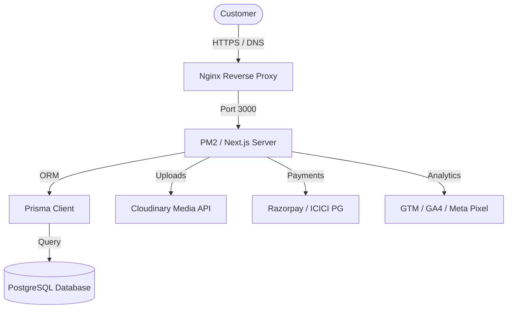

# Project Context: Laxmi Toyota Platform V3

Laxmi Toyota Platform V3 is a production-ready, custom-built web application designed for a Toyota dealership. It is built to replace a traditional, slow, and hard-to-manage WordPress site with a high-performance Next.js 15 app router application focused on lead generation, vehicle discovery, and online booking.

---

## 1. Core Objectives

* **High-Performance Lead Capture**: Serve as the central hub for Google Ads, Meta Ads, and organic SEO traffic.
* **Dealership CMS**: Allow the admin to manage branches, inventory (vehicles, variants, prices, colors, specs), and active offers.
* **Online Booking**: Secure test drives, vehicle bookings (with payment integration), and service appointments.
* **SEO Supremacy**: Outperform competitors in local and national search results for Toyota vehicles.

---

## 2. System Architecture

### Stack Breakdown
* **Frontend**: Next.js 15 (App Router), TypeScript, Tailwind CSS, shadcn/ui.
* **Backend**: Next.js API Routes / Server Actions.
* **Database**: PostgreSQL (managed/hosted on Hostinger VPS or local PostgreSQL service).
* **ORM**: Prisma.
* **Authentication**: Secure, single-admin credential login. Set via environment variables (`ADMIN_USERNAME` / `ADMIN_PASSWORD_HASH`). Handled via encrypted HTTP-only session cookies without database session tables.
* **Hosting**: Hostinger VPS (Ubuntu 24.04), Nginx as reverse proxy with SSL, PM2 for process management.
* **Media Storage**: Cloudinary for responsive and optimized images.
* **Payments**: Razorpay and ICICI Payment Gateway.
* **Analytics**: Google Analytics 4, Meta Pixel, Google Tag Manager.

---

## 3. Core Modules & Flow

1. **User Portal**:
   * Home Page: Interactive hero section, top vehicles, search tool, active offers.
   * Vehicle Catalog: Filter by model, fuel type, transmission, price. Interactive vehicle details, specs, brochure downloads, and 360-degree color preview.
   * Booking Engine: Test drive slots, service booking, and online vehicle booking with a booking deposit via Razorpay / ICICI.
2. **Admin Portal**:
   * Simple, secure login page.
   * CRM Dashboard: List, filter, export, and status-update lead records (bookings, service requests, test drives).
   * CMS Panel: CRUD interface for branches, vehicles, specs, images (linked to Cloudinary), and promotional banners.
